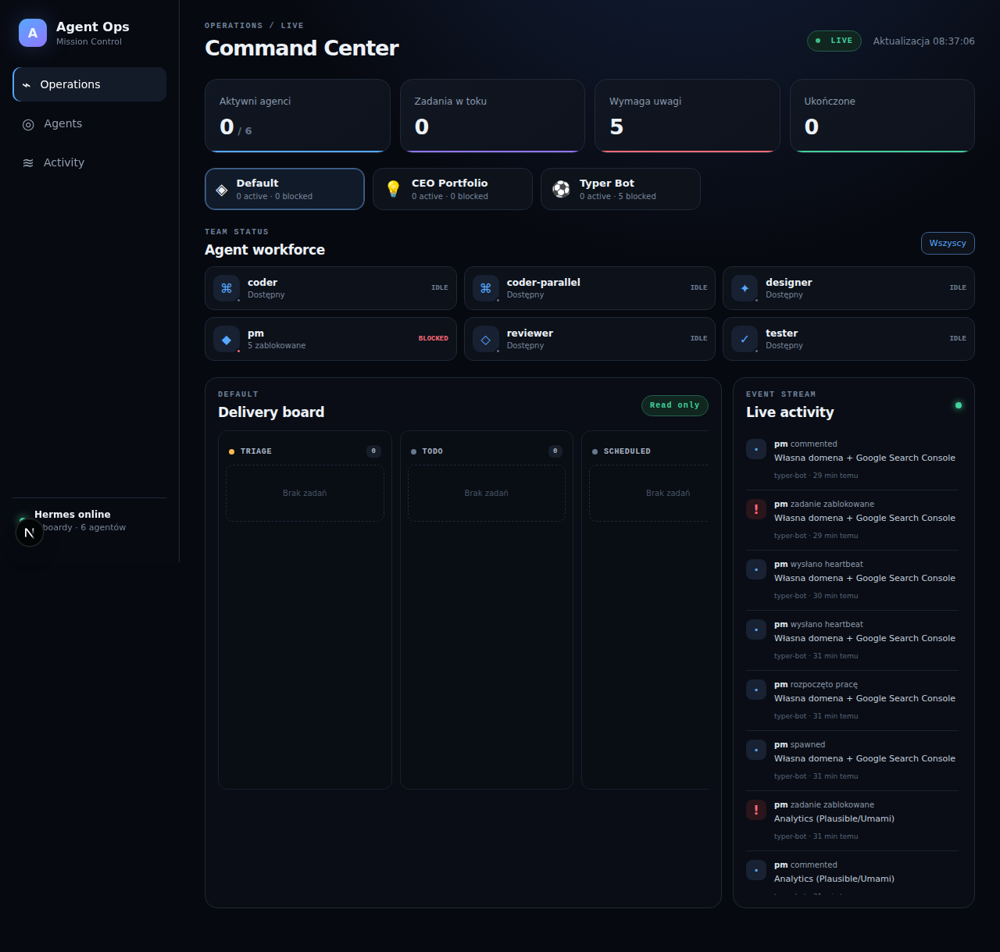

# Agent Operations Center

Read-only, live mission-control dashboard for a Hermes multi-agent team. It discovers all named Hermes Kanban boards, renders task lanes and agent presence, and streams board changes through SSE without exposing the Hermes dashboard API or filesystem paths to the browser.



## MVP features

- multi-board portfolio switcher;
- Kanban columns for `triage`, `todo`, `ready`, `running`, `blocked`, and `done`;
- agent presence and per-agent task filtering;
- live event stream powered by Hermes `task_events`;
- task drawer with dependencies, run history, comments, branch, and heartbeat;
- responsive dark mission-control UI;
- fail-closed HTTP Basic authentication in production;
- read-only SQLite connections and read-only Docker mounts.

## Local development

Requirements: Node.js 24+, npm, and a local Hermes installation.

```bash
cp .env.example .env.local
# Set credentials, or explicitly set AOC_DISABLE_AUTH=true for local-only development.
npm install
npm run dev -- --port 3010
```

Open `http://127.0.0.1:3010`. The default local data paths are `/root/.hermes/kanban` and `/root/.hermes/profiles`.

## VPS deployment

1. Copy `.env.example` to `.env` and set a long, unique password.
2. Build and start the private service:

```bash
docker compose up -d --build
docker compose ps
```

The container binds only to `127.0.0.1:3010`. Put Caddy or Nginx in front of it for TLS and a domain. Never change the mapping to `0.0.0.0` without a firewall and authentication layer.

Example Caddy site:

```caddy
agents.example.com {
    encode zstd gzip
    reverse_proxy 127.0.0.1:3010
}
```

## Security model

- The application opens SQLite with `readonly` and `query_only` enabled.
- Docker mounts only the Kanban root read-only. Profile homes and their `.env` files are not mounted; the public role roster is supplied through `AOC_AGENTS`.
- API responses deliberately omit worker PIDs, session IDs, claim locks, workspace paths, attachment paths, credentials, and environment variables.
- No write endpoint, shell command, merge, or deployment action exists in MVP.
- Basic auth is a minimum guard. For public production use, prefer an identity-aware reverse proxy such as Cloudflare Access or Authelia.

## Architecture

`HermesDataSource` is represented by `lib/hermes.ts`. UI and routes depend on its sanitized snapshot rather than the raw SQLite schema, so a future official Hermes API adapter can replace direct reads without redesigning the interface.
