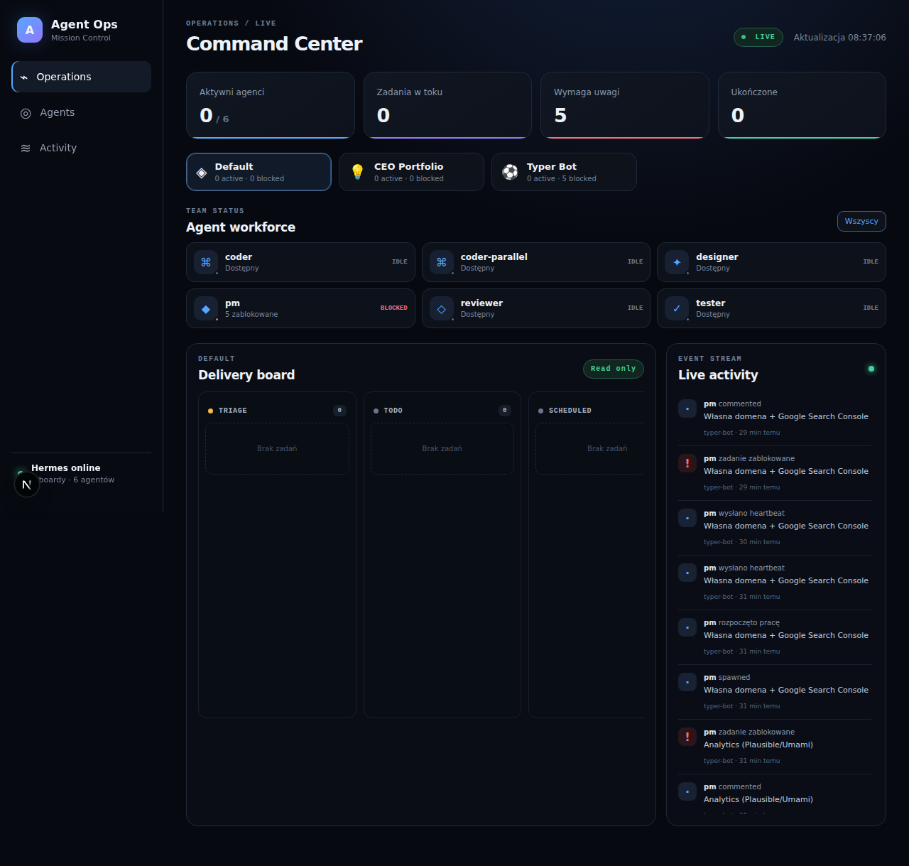

# Agent Operations Center

Live mission-control dashboard for a Hermes multi-agent team. It discovers all named Hermes Kanban boards, renders task lanes and agent presence, and streams board changes through SSE without exposing the Hermes dashboard API or filesystem paths to the browser.

The panel reads board state and executes controlled writes (create tasks, comment, move cards, CEO decisions) on the operator's behalf. Direct writes never touch the Kanban SQLite files — every mutation is delegated to the `hermes kanban` CLI through an asynchronous command broker.



## MVP features

- multi-board portfolio switcher;
- Kanban columns for `triage`, `todo`, `scheduled`, `ready`, `running`, `blocked`, `review`, and `done`;
- agent presence and per-agent task filtering;
- live event stream powered by Hermes `task_events`;
- task drawer with dependencies, run history, comments, branch, and heartbeat;
- CEO inbox for drafting/submitting ideas into project boards;
- write endpoints for task creation, DnD status moves, comments, and CEO decisions;
- responsive dark mission-control UI;
- fail-closed HTTP Basic authentication in production;
- read-only SQLite connections and read-only Docker mounts.

## Write endpoints

All mutating routes are gated by the origin check and the same auth as the UI. They return `202 Accepted` immediately: the payload is written to the broker's state database (`AOC_STATE_DB`) as a queued command, and the broker executes the actual `hermes kanban` CLI call asynchronously. Status changes stream back through SSE.

| Route | Action | Notes |
| --- | --- | --- |
| `POST /api/tasks` | Create a task | Enqueues a `create` move; validated (board, title 3–160, body 10–6000, priority 1–4). |
| `PATCH /api/tasks` | Move a task | DnD transitions only — restricted to moves the `hermes kanban` CLI can execute natively (see *Kanban transitions*). |
| `POST /api/comments` | Add a comment | Enqueues a `comment` move; written as `--author "CEO Web"`. |
| `POST /api/decisions` | CEO decision | `approve` / `reject` / `resume` / `hold`; resolves blocked cards through the decision flow (`unblock`/`block`), validated by `lib/decision-policy.ts`. |
| `POST /api/ideas` | Submit/draft a CEO idea | Enqueued as a broker command; on submission the broker creates a `pm`-assigned task. |
| `POST /api/account/password` | Self-service password change | Atomically rewrites the Authelia `users_database.yml` hash (argon2id PHC); kept in Authelia, not the app. |

Read-side routes (`GET /api/snapshot`, `/api/events`, `/api/trends`, `/api/scorecard`, `/api/audit/export`, `GET /api/tasks`, `GET /api/decisions`, `GET /api/ideas`) serve the sanitized board snapshot. Every write is recorded in the `audit_log`.

## Command broker

Mutations are queued in the broker's SQLite state DB (`/var/lib/agent-operations-center/aoc.db` in production, `AOC_STATE_DB` otherwise) as rows in `commands`, `task_moves`, and `task_decisions`. `scripts/process-commands.mjs` drains those queues and executes each one as a real `hermes kanban --board <slug> …` CLI invocation, so the panel never writes to the Kanban files directly — the CLI is the single write path.

- **Draining:** `lib/state.ts#triggerBroker` fires the script right after an enqueue (event-driven, non-blocking to the HTTP response); the script loops over pending commands, decisions, and moves (up to 100 iterations, retrying failures up to 3 times).
- **Runs as a service:** `deploy/aoc-hermes-broker.service` (systemd `oneshot`) executes `process-commands.mjs` with `ProtectSystem=strict` and write access only to `/var/lib/agent-operations-center` and `/root/.hermes`. It also performs a periodic Kanban backup (every 5 minutes, 24 rotating copies per board) and WAL checkpoints of all Hermes state databases.
- **Audit trail:** every executed command writes a row to `audit_log` (`actor='broker'`, e.g. `hermes.create`, `task.move.done`, `task.decision.done`).

In local dev the script runs in-process via `triggerBroker` when the systemd unit isn't installed; production uses the unit.

## Local development

Requirements: Node.js 24+, npm, and a local Hermes installation.

```bash
cp .env.example .env.local
# Set credentials, or explicitly set AOC_DISABLE_AUTH=true for local-only development.
npm install
npm run dev -- --port 3010
```

Open `http://127.0.0.1:3010`. The default local data paths are `/root/.hermes/kanban` and `/root/.hermes/profiles`.

## VPS deployment

1. Copy `.env.example` to `.env` and set a long, unique password.
2. Build and start the private service:

```bash
docker compose up -d --build
docker compose ps
```

The container binds only to `127.0.0.1:3010`. Put Caddy or Nginx in front of it for TLS and a domain. Never change the mapping to `0.0.0.0` without a firewall and authentication layer.

Example Caddy site with Authelia (see `docker-compose.yml` for the Authelia service; you must create `deploy/authelia/` with your own `configuration.yml` + `users_database.yml`):

```caddy
agents.example.com {
    encode zstd gzip
    reverse_proxy 127.0.0.1:3010
}
```

Authelia must be configured to emit `remote-user` and `remote-groups` headers (the app reads exactly these two). It must also **strip inbound `remote-user` / `remote-groups` headers from clients** — otherwise the header trust chain is broken. Basic auth or Authelia without 2FA is a minimum guard; prefer enforcing 2FA in the identity provider for public deployments.

> Writes require the broker's `hermes` CLI to be reachable and the `/var/lib/agent-operations-center` state volume writable by the dashboard container. If the broker or CLI is unavailable, mutations queue in `aoc.db` and are applied when the broker next runs — the panel falls back to read-only presentation rather than failing.

### Password management

The panel deliberately does **not** manage passwords centrally — that stays in Authelia's hands, with a self-service change endpoint that rewrites the hash atomically:

- **Self-service change**: the panel's `POST /api/account/password` verifies the current hash, generates a new argon2id PHC hash, and atomically renames it into Authelia's `users_database.yml` (no YAML editing by hand).
- **Self-service reset (admin/email)**: Authelia's built-in reset-password flow (requires SMTP in `deploy/authelia/configuration.yml`).
- **Admin (no SMTP needed)**: `docker exec agent-operations-center-authelia-1 authelia admin user password <username>` — sets a new hash atomically via Authelia's own CLI.
- **Brute-force protection**: enforced by Authelia itself (per-user/IP bans), not by the app.

### Kanban transitions (DnD)

The drag-and-drop surface only exposes transitions the `hermes kanban` CLI can execute natively (`schedule`, `claim`, `block`, `complete`, `reopen-review`; blocked tasks move through the CEO decision flow via `unblock`). Other lanes are agent-driven by design (`triage` is specified/decomposed by agents, `scheduled→ready` happens via `recompute_ready`, `review→done` by the reviewer) — a comment alone never changes task status. Moves are queued and applied by the broker via the CLI.

### CSP in development

The middleware adds `'unsafe-eval'` to `script-src` only when `NODE_ENV !== "production"` (React dev mode requirement). Production builds (`next start` / the Docker image) never include it. If you run a staging environment, make sure it boots with `NODE_ENV=production`.

## Security model

- **Read path is read-only by construction:** the app opens SQLite with `readonly` and `query_only` enabled. On a read-only Docker mount where WAL `-wal`/`-shm` cannot be created, `openReadOnly` falls back to copying the (broker-checkpointed) database file into the writable tmp dir and reads the copy — stale copies are swept on each fallback open.
- **Writes are never direct:** the app does not open a write handle to the Kanban databases. All mutations go through the broker, which executes the `hermes kanban` CLI as the sole write path. Read-only mode is a **fallback** when the broker/CLI is unavailable, not the primary operating mode.
- Docker mounts only the Kanban root read-only. Profile homes and their `.env` files are not mounted; the public role roster is supplied through `AOC_AGENTS`.
- API responses deliberately omit worker PIDs, session IDs, claim locks, workspace paths, attachment paths, credentials, and environment variables.
- Basic auth is a minimum guard. For public production use, prefer an identity-aware reverse proxy such as Cloudflare Access or Authelia.

## Architecture

`HermesDataSource` is represented by `lib/hermes.ts`. UI and routes depend on its sanitized snapshot rather than the raw SQLite schema, so a future official Hermes API adapter can replace direct reads without redesigning the interface.

State for queued commands, decisions, and the audit log lives in the broker's SQLite DB (`lib/state.ts`). `lib/transitions.ts` is the single source of truth for which Kanban status moves the panel may request, shared by the DnD UI, the move API, and the broker. The broker (`scripts/process-commands.mjs`) is the boundary between the web panel and the Hermes CLI.
